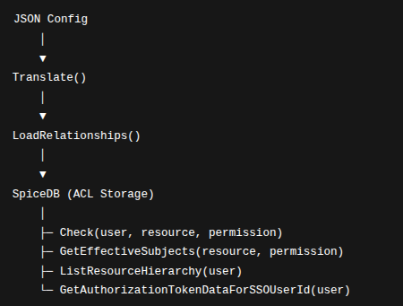

# drive-acl

Reusable authz library (SpiceDB) + example Gin service.

## Install (as a library)
go get github.com/kavyaveer/drive-acl@latest

## Import
import "github.com/kavyaveer/drive-acl/authz"

---

# **`authz` – ACL Utilities for SpiceDB**

**`authz`** is a Go package providing helper utilities to **interact with SpiceDB (Authzed)** in a Go microservice.
It wraps the Authzed gRPC API with developer-friendly functions for:

* **Loading relationships**
* **Checking permissions**
* **Retrieving resource hierarchies**
* **Generating authorization tokens**

This package is designed for **nested ACLs**, role-based access, and hierarchical resource structures (partners → advertisers → features → pages/APIs).

---

## **🔧 Initialization**

Before using any ACL function, initialize the SpiceDB gRPC client:

```go
import "yourproject/authz"

func main() {
    // Connect to SpiceDB
    authz.InitClient("localhost:50051", "spicedb-secret")

    // Now you can use all authz functions
}
```
## **🗂 Data Flow Overview**

JSON Config → Translate() → SpiceDB Relationship Strings

Load Relationships → LoadRelationships()

User Requests → Check(), GetEffectiveSubjects(), ListResourceHierarchy()

SSO User → GetAuthorizationTokenDataForSSOUserId() → downstream services

ASCII Diagram:



---
## **2. Translate(jsonData map[string]interface{}) []string**

Purpose: Converts nested JSON ACL configuration into SpiceDB relationship strings.

Input Example:
```go
input := map[string]interface{}{
  "partners": map[string]interface{}{
    "Dentsu": map[string]interface{}{
      "users": []interface{}{"alice", "bob"},
      "roles": []interface{}{"admin"},
    },
  },
  "advertisers": map[string]interface{}{
    "123": map[string]interface{}{
      "parent": "partner:Dentsu",
      "users":  []interface{}{"charlie"},
    },
  },
}

```

Output Example:
```go
partner:Dentsu#user@users:alice
partner:Dentsu#user@users:bob
partner:Dentsu#role@roles:admin
advertiser:123#parent@partner:Dentsu
advertiser:123#user@users:charlie
```
Notes:

* Handles partners, advertisers, publishers, roles, features, pages, APIs

* Supports nested features recursively
## **🛠 Core Functions**

### **1. `Check(user, objectType, objectID, permission string) bool`**

**Purpose**: Checks whether a given user has a specific permission on a resource.

```go
ok := authz.Check("alice", "advertiser", "123", "view")
if ok {
    fmt.Println("Alice can view advertiser 123")
} else {
    fmt.Println("Access denied")
}
```

**Inputs**:

* **`user`** → Subject ID (e.g., `"alice"`)
* **`objectType`** → Resource type (`partner`, `advertiser`, `feature`, etc.)
* **`objectID`** → Resource ID (`123`)
* **`permission`** → Permission defined in your SpiceDB schema (`view`, `edit`, `delete`, …)

**Output**:

* `true` → user has permission
* `false` → user does not have permission

---

### **2. `InitClient(addr, secret string)`**

**Purpose**: Creates a gRPC client to connect to SpiceDB.

```go
authz.InitClient("spicedb:50051", "spicedb-secret")
```

* **`addr`** → SpiceDB gRPC address
* **`secret`** → Bearer token for authentication

---

### **3. `GetDirectSubjects(resourceType, resourceID, relation, subjectType string) ([]string, error)`**

**Purpose**: Reads **direct relationships** (not inherited) from a resource.

```go
subs, _ := authz.GetDirectSubjects("partner", "Dentsu", "user", "users")
fmt.Println("Users directly attached to partner Dentsu:", subs)
```

* Useful for listing **explicit assignments**, e.g., direct users of a partner.

---

### **4. `LoadRelationships(rels []string)`**

**Purpose**: Loads relationship strings into SpiceDB.

```go
rels := []string{
    "partner:Dentsu#user@users:alice",
    "advertiser:123#parent@partner:Dentsu",
    "roles:admin#user@users:alice",
}
authz.LoadRelationships(rels)
```

* **Input format**:

```
resourceType:resourceID#relation@subjectType:subjectID
```

* Example: `partner:Dentsu#user@users:alice` → Alice is a user of partner Dentsu.

---

### **5. `ListResourceHierarchy(resourceType, permission, subjectType, subjectID string) *Node`**

**Purpose**: Returns a **hierarchical tree** of resources accessible by a subject.

```go
tree := authz.ListResourceHierarchy("partner", "view", "users", "alice")
fmt.Printf("%+v\n", tree)
```

* Returns a tree of **`Node{ID, Type, Children}`**
* Lists all the partners (Resource) that the user (Subject) can access with the view permission, taking the whole tree into consideration not a specific subtree.

---

### **6. `ListResourceSubtree(rootType, rootID, permission, subjectType, subjectID, targetType string) *Node`**

**Purpose**: Returns a **subtree of a specific type**, e.g., features under an advertiser.

```go
subtree := authz.ListResourceSubtree("partner", "Dentsu", "view", "users", "alice", "feature")
```

* Only includes nodes of **`targetType`**
* Ensures the subtree is rooted under the specified root resource

---

### **7. `GetEffectiveSubjects(resourceType, resourceID, permission, subjectType string) ([]string, error)`**

**Purpose**: Returns **all subjects (direct + inherited)** who have permission on a resource.

```go
users, _ := authz.GetEffectiveSubjects("advertiser", "123", "view", "users")
fmt.Println("Users who can view advertiser 123:", users)
```

* **Differs from `GetDirectSubjects`** because it follows **inheritance and role mappings**

---

### **8. `GetAuthorizationTokenDataForSSOUserId(ssoUserId int64, partnerID *int64) (*AuthorizationToken, error)`**

**Purpose**: Builds a **JWT-style token payload** with resolved access.

```go
token, _ := authz.GetAuthorizationTokenDataForSSOUserId(42, nil)
fmt.Printf("%+v\n", token)
```

**Example Output**:

```json
{
  "user_id": 42,
  "account_id": 101,
  "account_name": "Dentsu",
  "role_id": 5,
  "advertiser_ids": [123, 456, 789]
}
```

* Internally uses:

  * `ListResourceHierarchy("partner", "view", …)` → resolve partners
  * `ListResourceHierarchy("roles", "user", …)` → resolve roles
  * `ListResourceHierarchy("advertiser", "view", …)` → resolve advertisers

---

### **9. `Translate(jsonData map[string]interface{}) []string`**

**Purpose**: Converts **JSON configuration → SpiceDB relationship strings**.

```go
input := map[string]interface{}{
  "partners": map[string]interface{}{
    "Dentsu": map[string]interface{}{
      "users": []interface{}{"alice", "bob"},
      "roles": []interface{}{"admin"},
    },
  },
  "advertisers": map[string]interface{}{
    "123": map[string]interface{}{
      "parent": "partner:Dentsu",
      "users":  []interface{}{"charlie"},
    },
  },
}
rels := authz.Translate(input)
authz.LoadRelationships(rels)
```

**Example Output**:

```
partner:Dentsu#user@users:alice
partner:Dentsu#user@users:bob
partner:Dentsu#role@roles:admin
advertiser:123#parent@partner:Dentsu
advertiser:123#user@users:charlie
```

* Supports **roles, partners, advertisers, publishers, features, pages, APIs**
* Handles **nested features recursively**

---

## **📌 Typical Workflow**

```go
// 1. Init client
authz.InitClient("spicedb:50051", "spicedb-secret")

// 2. Load ACLs from JSON config
rels := authz.Translate(jsonConfig)
authz.LoadRelationships(rels)

// 3. Check access
if authz.Check("alice", "advertiser", "123", "view") {
    fmt.Println("Alice can view advertiser 123")
}

// 4. Build token for SSO user
token, _ := authz.GetAuthorizationTokenDataForSSOUserId(42, nil)
fmt.Printf("Auth Token: %+v\n", token)

// 5. Get hierarchy
tree := authz.ListResourceHierarchy("partner", "view", "users", "alice")
fmt.Printf("Partner Hierarchy: %+v\n", tree)
```

---

## **🌟 Summary**

The **`authz`** package provides:

* **Easy permission checks** → `Check()`
* **Bulk relationship loading** → `LoadRelationships()`, `Translate()`
* **Hierarchy traversal** for UI/API → `ListResourceHierarchy()`, `ListResourceSubtree()`
* **Token generation for downstream services** → `GetAuthorizationTokenDataForSSOUserId()`
* **Query direct or effective subjects** → `GetDirectSubjects()`, `GetEffectiveSubjects()`

It **abstracts direct gRPC calls to SpiceDB**, letting developers focus on **business logic instead of ACL plumbing**.

---